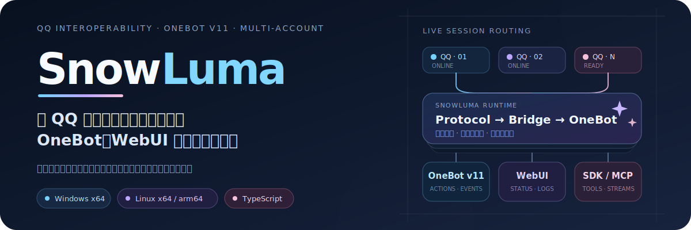
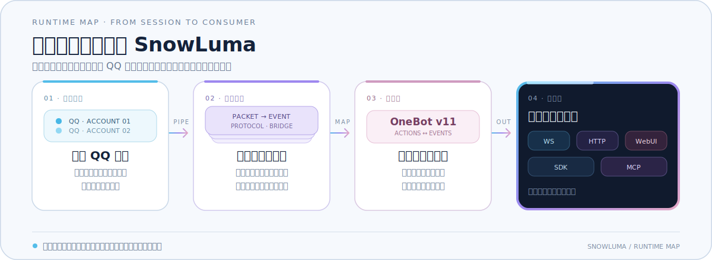

<p align="center">
  
</p>

<p align="center">
  <a href="https://github.com/SnowLuma/SnowLuma/releases"></a>
  <a href="https://github.com/SnowLuma/SnowLuma/actions/workflows/dev-build.yml"></a>
  <a href="https://www.npmjs.com/package/@snowluma/sdk"></a>
  <a href="https://www.npmjs.com/package/@snowluma/mcp"></a>
  <a href="https://github.com/SnowLuma/SnowLuma/stargazers"></a>
</p>

<p align="center">
  <a href="#快速开始">快速开始</a> ·
  <a href="#运行链路">运行链路</a> ·
  <a href="./docs/onebot-actions.md">动作参考</a> ·
  <a href="./packages/sdk/README.md">SDK</a> ·
  <a href="./packages/mcp/README.md">MCP</a> ·
  <a href="https://github.com/SnowLuma/SnowLuma/issues">问题反馈</a>
</p>

SnowLuma 是面向 QQ 客户端的 TypeScript 互操作运行时。它把 QQ 原生会话转换为 [OneBot v11](https://github.com/botuniverse/onebot-11) 动作与事件，并通过 WebSocket、HTTP、WebUI、SDK 和 MCP 提供统一入口；每个账号拥有独立会话，适合机器人开发、自动化与协议研究。

> [!CAUTION]
> **使用边界**：SnowLuma 是独立的第三方互操作项目，**与腾讯 / QQ 无任何隶属或授权关系**。本项目仅供学习与技术研究，请遵守《QQ 用户协议》及适用法律；软件按“现状”提供、不附带任何担保，使用风险自负。详见 [`EULA.md`](EULA.md)。
>
> **Disclaimer**: SnowLuma is an independent third-party interoperability project with no affiliation with or endorsement by Tencent / QQ. It is provided for study and research only, “as is” and without warranty. See [`EULA.md`](EULA.md).

## 运行链路

<p align="center">
  
</p>

SnowLuma 将会话接入、协议解析、身份映射、OneBot 转换和网络适配拆成清晰边界。多个 QQ 账号可以并行运行，同时保持独立状态、日志与连接配置。

## 核心能力

| 场景 | SnowLuma 提供 |
| --- | --- |
| OneBot 接入 | OneBot v11 动作与事件，支持 WebSocket 服务端 / 客户端及 HTTP 服务端 / 上报 |
| 消息与媒体 | 文本、图片、语音、视频、文件、回复、提及、转发及 JSON / XML 卡片等常见消息元素 |
| 多账号运行 | 每个 QQ 账号独立维护会话、身份映射、消息存储与网络适配器 |
| WebUI 管理 | 账号状态、实时日志、连接配置、动作调试、密码管理与可定制总览 |
| 开发者工具 | 提供 [`@snowluma/sdk`](packages/sdk/README.md) 与 [`@snowluma/mcp`](packages/mcp/README.md) |
| 可观察错误 | 关键解析与执行失败会留下明确上下文，不以静默丢弃掩盖问题 |

## 快速开始

### 1. 选择发行包

前往 [Releases](https://github.com/SnowLuma/SnowLuma/releases) 下载与你的平台匹配的版本：

| 平台 | 完整版（内置 Node.js，推荐） | Lite（需要 Node.js 22+） |
| --- | --- | --- |
| Windows x64 | `SnowLuma-vX.Y.Z-win-x64.zip` | `SnowLuma-vX.Y.Z-win-x64-lite.zip` |
| Linux x64 | `SnowLuma-vX.Y.Z-linux-x64.tar.gz` | `SnowLuma-vX.Y.Z-linux-x64-lite.tar.gz` |
| Linux arm64 | `SnowLuma-vX.Y.Z-linux-arm64.tar.gz` | `SnowLuma-vX.Y.Z-linux-arm64-lite.tar.gz` |

完整版适合直接解压运行；Lite 版只移除了内置 Node.js，其余运行时依赖与 WebUI 静态资源保持一致。

### 2. 启动 SnowLuma

Windows 运行 `launcher.bat`。Linux 在解压目录执行：

```bash
chmod +x launcher.sh
./launcher.sh
```

### 3. 打开 WebUI

浏览器访问 [`http://localhost:5099`](http://localhost:5099)。初始账号为 `admin`，随机密码会显示在启动日志中；登录后即可接入已启动的 QQ 进程并配置 OneBot 连接。

<details>
<summary><strong>无人值守部署：通过环境变量确认协议</strong></summary>

同时设置以下两个变量可跳过 WebUI 的协议确认页面：

```bash
SNOWLUMA_ACCEPT_EULA=1
SNOWLUMA_ACCEPT_PRIVACY=1
```

两项必须同时设置，且环境变量确认不会写入持久化同意记录。设置变量即表示运营者已阅读并同意 [`EULA.md`](EULA.md) 与 [`PRIVACY.md`](PRIVACY.md)。

</details>

## 选择接入方式

| 入口 | 适合场景 | 参考 |
| --- | --- | --- |
| WebSocket / HTTP | 对接现有 OneBot 机器人框架 | [OneBot 动作参考](docs/onebot-actions.md) |
| TypeScript SDK | 编写类型安全的客户端与消息逻辑 | [`packages/sdk`](packages/sdk/README.md) |
| MCP | 让支持 MCP 的工具查询或调用 SnowLuma 动作 | [`packages/mcp`](packages/mcp/README.md) |
| WebUI | 管理运行状态、日志、账号与连接 | 启动后访问 `http://localhost:5099` |

## 开发与贡献

本地开发需要 Node.js 22+ 与项目锁定版本的 pnpm。所有日常开发基于 `dev` 分支：

```bash
git clone https://github.com/SnowLuma/SnowLuma.git
cd SnowLuma
git checkout dev
pnpm install
pnpm typecheck
pnpm test
```

- 先读 [`CONTEXT.md`](CONTEXT.md) 了解模块边界与项目词汇。
- 提交代码前阅读 [`CONTRIBUTING.md`](CONTRIBUTING.md) 与 [`CODE_OF_CONDUCT.md`](CODE_OF_CONDUCT.md)。
- 开发方向与已完成事项见 [`RoadMap.md`](RoadMap.md)。

<details>
<summary><strong>主要目录</strong></summary>

| 路径 | 作用 |
| --- | --- |
| `packages/protocol` | QQ 协议定义、数据包解析、消息推送与 OIDB 服务 |
| `packages/onebot` | OneBot 动作执行、事件转换与网络适配 |
| `packages/core` | 运行时编排、QQ 会话桥接与 WebUI 服务端 |
| `packages/webui` | React 管理界面 |
| `packages/sdk` | 对外发布的 TypeScript SDK |
| `packages/mcp` | 面向 MCP 客户端的动作目录与执行入口 |

</details>

## 使用边界与许可

> [!IMPORTANT]
> SnowLuma 使用 **源码可见非商业许可**，**不是 OSI 开源许可**。源码可用于查看、学习、非商业自托管及私下修改；任何商业使用，以及公开发布修改版或衍生版，均需事先取得书面授权。

- 完整条款见 [`LICENSE`](LICENSE)。
- 随附的原生附加组件为专有组件，不在源码许可范围内。
- 二进制发行包另受 [`EULA.md`](EULA.md) 与 [`PRIVACY.md`](PRIVACY.md) 约束。
- 商业授权请联系 `motricseven@foxmail.com`。

SnowLuma is source-available for study and non-commercial self-hosting, but it is **not OSI open source**. Commercial use and public distribution of modified or derivative versions require prior written permission. Bundled native components are proprietary and excluded from the source license.

## 社区与支持

- [提交问题](https://github.com/SnowLuma/SnowLuma/issues)
- [QQ 群](https://qm.qq.com/q/g3UMLpWALe)
- [Telegram](https://t.me/napcatqq)

## 鸣谢

项目参考了 [LagrangeV2](https://github.com/LagrangeDev/LagrangeV2) 的协议定义与 [NapCatQQ](https://github.com/NapNeko/NapCatQQ) 的实现思路。

<p align="center">
  <a href="https://github.com/SnowLuma/SnowLuma/graphs/contributors"></a>
</p>
